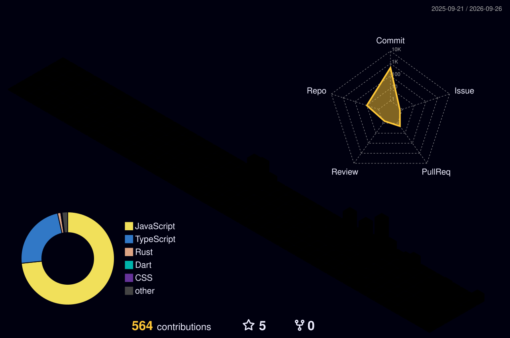
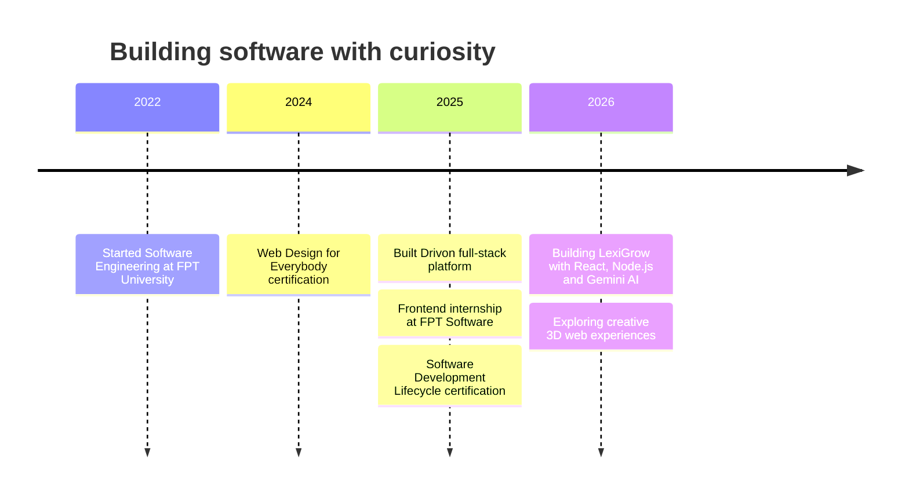

<div align="center">



[](https://git.io/typing-svg)

[](https://ltcuong24.id.vn)
[](mailto:lethecuong2k4@gmail.com)
[](https://github.com/ekancisme?tab=followers)


</div>


### `> whoami`

```yaml
name: Lê Thế Cường
role: Full-stack Developer
education: Software Engineering @ FPT University Đà Nẵng
experience: Frontend Developer Intern @ FPT Software
location: Đà Nẵng, Việt Nam
focus:
  - Scalable full-stack web applications
  - Generative AI and NLP integrations
  - Creative WebGL and 3D interfaces
currently_building: LexiGrow
```

- I turn product ideas into responsive, maintainable web experiences.
- I enjoy connecting polished React interfaces to robust APIs and AI systems.
- I care about clean code, system thinking, accessibility and useful motion.
- Ask me about **React, Next.js, Spring Boot, Node.js, MongoDB or Gemini AI**.

<br clear="both" />


## ⚡ Tech constellation

<div align="center">

[](https://skillicons.dev)


</div>

## 🚀 Featured builds

<table>
<tr>
<td width="50%" valign="top">

### 🌿 [LexiGrow](https://github.com/ekancisme/lexigrow)

AI-powered English learning platform built around a focused micro-learning loop. It evaluates writing, measures lexical diversity, recommends vocabulary and turns progress into an interactive learning journey.

`React 19` `Node.js` `Express` `MongoDB` `Gemini AI` `OAuth/JWT` `3D Flashcards`

[](https://github.com/ekancisme/lexigrow)

</td>
<td width="50%" valign="top">

### 🚘 [Drivon](https://github.com/ekancisme/drivon)

Full car-rental management platform with Admin, Owner and Customer roles, real-time messaging, automated contract PDFs, revenue analytics and a relational schema with 30+ tables.

`Java 17` `Spring Boot 3` `Spring Security` `React` `MySQL` `WebSocket` `Google OAuth`

[](https://github.com/ekancisme/drivon)

</td>
</tr>
</table>

## 📡 Live GitHub telemetry

<div align="center">

<picture>
  <source media="(prefers-color-scheme: dark)" srcset="https://github-readme-stats.vercel.app/api?username=ekancisme&show_icons=true&include_all_commits=true&count_private=true&hide_border=true&rank_icon=github&theme=tokyonight" />
  <source media="(prefers-color-scheme: light)" srcset="https://github-readme-stats.vercel.app/api?username=ekancisme&show_icons=true&include_all_commits=true&count_private=true&hide_border=true&rank_icon=github&theme=default" />
  
</picture>
<picture>
  <source media="(prefers-color-scheme: dark)" srcset="https://github-readme-stats.vercel.app/api/top-langs/?username=ekancisme&layout=compact&langs_count=8&hide_border=true&theme=tokyonight" />
  <source media="(prefers-color-scheme: light)" srcset="https://github-readme-stats.vercel.app/api/top-langs/?username=ekancisme&layout=compact&langs_count=8&hide_border=true&theme=default" />
  
</picture>

[](https://git.io/streak-stats)

[](https://github.com/ashutosh00710/github-readme-activity-graph)

<picture>
  <source media="(prefers-color-scheme: dark)" srcset="https://raw.githubusercontent.com/ekancisme/ekancisme/output/github-contribution-grid-snake-dark.svg" />
  <source media="(prefers-color-scheme: light)" srcset="https://raw.githubusercontent.com/ekancisme/ekancisme/output/github-contribution-grid-snake.svg" />
  
</picture>

</div>

## 🏆 Achievements unlocked

<div align="center">

[](https://github.com/ryo-ma/github-profile-trophy)



</div>

## 🧭 Journey



## 🐍 Contribution arcade

<div align="center">

<!-- The Pac-Man graph appears after the workflow's first successful run. -->
<picture>
  <source media="(prefers-color-scheme: dark)" srcset="https://raw.githubusercontent.com/ekancisme/ekancisme/output/pacman-contribution-graph-dark.svg" />
  <source media="(prefers-color-scheme: light)" srcset="https://raw.githubusercontent.com/ekancisme/ekancisme/output/pacman-contribution-graph.svg" />
  
</picture>

</div>

<details>
<summary><b>🕹️ Open the full contribution arcade</b></summary>
<br />

<div align="center">


</div>
</details>

<details>
<summary><b>🎯 More about how I work</b></summary>
<br />

I work well in Agile/Scrum teams and like taking a feature from Figma through reusable components, API integration, error handling and final UX polish. My current interests sit where full-stack engineering meets generative AI, learning science and interactive 3D interfaces.

**Certifications:** Web Design for Everybody: Basics of Web Development & Coding · Software Development Lifecycle

</details>

<details>
<summary><b>🎮 A tiny developer quest</b></summary>
<br />

```text
MISSION       Ship experiences people enjoy using
MAIN CLASS    Full-stack Developer
POWER-UPS     React · Spring Boot · Node.js · AI
SIDE QUEST    Creative Web & 3D Interactive UI
PARTY MODE    Teamwork · Agile/Scrum · Code Review
NEXT LEVEL    Scalable, high-performance systems
```

</details>

<div align="center">

### 💬 Let's build something memorable

[](https://ltcuong24.id.vn)
[](mailto:lethecuong2k4@gmail.com)


<sub>Designed with code, curiosity and a slightly unreasonable number of animations.</sub>

</div>
